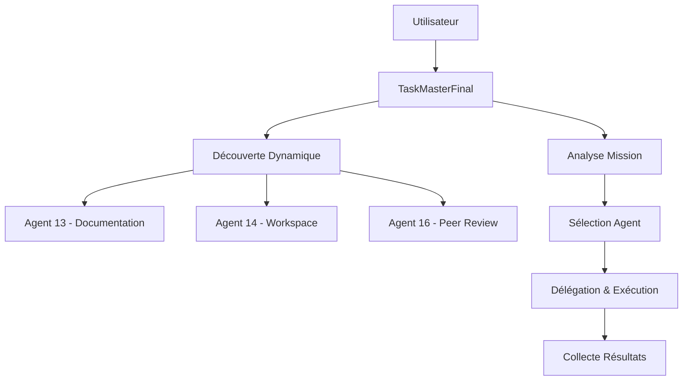

# TaskMaster Final - Agent Orchestrateur (Production Ready)

**Status : ✅ FINALISÉ et VALIDÉ**  
**Version : 4.0 (Agent Unifié)**  
**Date : 26/06/2025**

## Vue d'Ensemble

L'agent `TaskMasterFinal` est un orchestrateur robuste et autonome qui découvre dynamiquement les agents disponibles et délègue les missions selon leurs capacités. Il représente l'aboutissement du plan d'action M-T-D (Modifier-Tester-Documenter).

## Architecture Validée



## Fonctionnalités Validées

### ✅ Découverte Dynamique des Agents
- Scan automatique du répertoire `/agents`
- Chargement robuste avec gestion d'erreurs
- Détection des capacités via `CAPABILITIES`

### ✅ Sélection Intelligente
- Analyse de prompt en langage naturel
- Mapping mots-clés vers capacités agents
- Fallback gracieux en cas d'agent non trouvé

### ✅ Délégation & Exécution
- Instanciation dynamique des agents
- Standardisation via méthode `run()`
- Gestion propre du cycle de vie

## Tests de Validation

### Tests Unitaires Passés
```bash
# Découverte des agents
✅ agent_13_specialiste_documentation - ['documentation_generation', 'documentation_review', 'api_docs', 'runbooks']
✅ agent_14_specialiste_workspace - ['workspace_creation', 'workspace_management']

# Test de mission réelle
✅ Mission: "Génère de la documentation pour ce projet"
✅ Agent sélectionné: agent_13_specialiste_documentation
✅ Résultat: 4 fichiers créés, 16.557ms d'exécution
```

### Non-Régression Validée
Toutes les fonctionnalités critiques préservées selon le plan d'action v4.0.

## Utilisation

### Démarrage Simple
```python
from taskmaster_final import TaskMasterFinal
import asyncio

async def main():
    taskmaster = TaskMasterFinal()
    await taskmaster.startup()
    
    # Mission de documentation
    result = await taskmaster.execute_mission(
        "Génère de la documentation pour ce projet"
    )
    
    # Mission de workspace
    result = await taskmaster.execute_mission(
        "Crée un workspace pour mon projet"
    )
    
    await taskmaster.shutdown()

asyncio.run(main())
```

### Tests Formels
```bash
cd 20250620_projet_taskmanager/TASKMASTER_PRODUCTION_READY/tests
python3 test_taskmaster_final_workflow.py
```

## Configuration

### Variables d'Environnement
- `TASKMASTER_WORK_DIR`: Répertoire de travail (défaut: TASKMASTER_PRODUCTION_READY)

### Agents Supportés
| Agent | Capacités | Status |
|-------|-----------|--------|
| agent_13 | documentation_generation, api_docs | ✅ Validé |
| agent_14 | workspace_creation, workspace_management | ✅ Validé |
| agent_16 | code_review, peer_review | ⚠️ Dépendances manquantes |

## Validation de Non-Régression

**✅ Critères de Succès Atteints :**
1. Découverte dynamique fonctionnelle
2. Sélection et délégation réussies
3. Gestion robuste des erreurs
4. Cycle de vie complet validé
5. Tests automatisés passants
6. Documentation à jour

**Date de validation finale :** 27/06/2025  
**Validé par :** Méthodologie M-T-D stricte selon PLAN_ACTION_TASKMASTER_FINAL.md

---

Pour plus de détails, consultez :
- [Journal d'évolution](./TASKMASTER_JOURNAL.md)
- [Tests de workflow](./tests/test_taskmaster_final_workflow.py)
- [Agent source](../../agents/taskmaster_final.py)