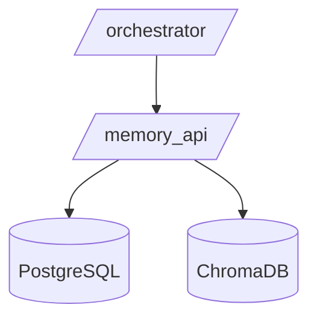

# Livrable 4 : Configuration Docker Compose

- **Conteneurs** : `postgres`, `chromadb`, `memory_api`, `orchestrator`.
- **Volumes persistants** pour PostgreSQL et Chroma.
- **Variables d’environnement** chargées depuis `.env`.
- **Démarrage fiable** : `depends_on` + `healthcheck`.
- **Ports exposés** :  
  - `5432` (PostgreSQL)  
  - `8000` (orchestrator)  
  - `8001` (memory_api)  
  - `8002` (chromadb).

> Le fichier `docker-compose.yml` simplifie le déploiement local d’un cluster
complet, prêt pour le développement et les tests.
Livrable 4 : Configuration Docker Compose
docker-compose.yml
yamlversion: '3.8'

services:
  # Service PostgreSQL pour la mémoire à court terme
  postgres:
    image: postgres:16-alpine
    container_name: agent_postgres
    environment:
      POSTGRES_USER: ${POSTGRES_USER:-postgres}
      POSTGRES_PASSWORD: ${POSTGRES_PASSWORD:-postgres}
      POSTGRES_DB: ${POSTGRES_DB:-agent_memory}
    volumes:
      - postgres_data:/var/lib/postgresql/data
    ports:
      - "5432:5432"
    healthcheck:
      test: ["CMD-SHELL", "pg_isready -U postgres"]
      interval: 10s
      timeout: 5s
      retries: 5
    networks:
      - agent_network

  # Service ChromaDB pour la mémoire à long terme
  chromadb:
    image: chromadb/chroma:latest
    container_name: agent_chromadb
    volumes:
      - chroma_data:/chroma/chroma
    environment:
      IS_PERSISTENT: TRUE
      PERSIST_DIRECTORY: /chroma/chroma
      ANONYMIZED_TELEMETRY: FALSE
    ports:
      - "8000:8000"
    healthcheck:
      test: ["CMD", "curl", "-f", "http://localhost:8000/api/v1/heartbeat"]
      interval: 10s
      timeout: 5s
      retries: 5
    networks:
      - agent_network

  # API de mémoire hybride
  memory_api:
    build:
      context: ./memory_api
      dockerfile: Dockerfile
    container_name: agent_memory_api
    environment:
      - OPENAI_API_KEY=${OPENAI_API_KEY}
      - POSTGRES_HOST=postgres
      - POSTGRES_USER=${POSTGRES_USER:-postgres}
      - POSTGRES_PASSWORD=${POSTGRES_PASSWORD:-postgres}
      - POSTGRES_DB=${POSTGRES_DB:-agent_memory}
      - CHROMA_HOST=chromadb
      - CHROMA_PORT=8000
    volumes:
      - ./codebase_docs:/app/codebase_docs:ro
      - ./memory_api/app:/app/app:ro
    ports:
      - "8001:8001"
    depends_on:
      postgres:
        condition: service_healthy
      chromadb:
        condition: service_healthy
    networks:
      - agent_network

  # Service d'orchestration LangGraph
  orchestrator:
    build:
      context: ./orchestrator
      dockerfile: Dockerfile
    container_name: agent_orchestrator
    environment:
      - OPENAI_API_KEY=${OPENAI_API_KEY}
      - ANTHROPIC_API_KEY=${ANTHROPIC_API_KEY}
      - MEMORY_API_URL=http://memory_api:8001
    volumes:
      - ./orchestrator/app:/app/app:ro
    ports:
      - "8002:8002"
    depends_on:
      - memory_api
    networks:
      - agent_network

networks:
  agent_network:
    driver: bridge

volumes:
  postgres_data:
  chroma_data:
.env.example
bash# Clés API pour les LLMs
OPENAI_API_KEY=your_openai_api_key_here
ANTHROPIC_API_KEY=your_anthropic_api_key_here

# Configuration PostgreSQL
POSTGRES_USER=postgres
POSTGRES_PASSWORD=secure_password_here
POSTGRES_DB=agent_memory

# Configuration des services (optionnel)
MEMORY_API_URL=http://memory_api:8001
ORCHESTRATOR_URL=http://orchestrator:8002

# Configuration ChromaDB (optionnel)
CHROMA_HOST=chromadb
CHROMA_PORT=8000