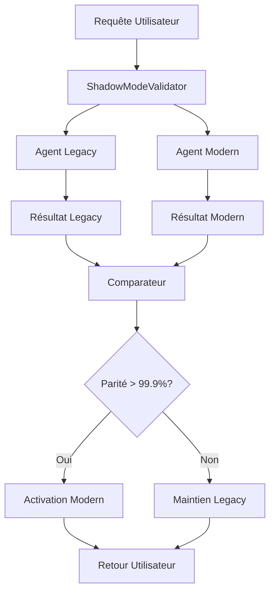

# 📋 RAPPORT STRATÉGIE DE MIGRATION NEXTGENERATION

*Documentation officielle de la stratégie de migration pour faciliter l'onboarding*

## 🎯 Executive Summary

### Stratégie Réelle de Migration NextGeneration

La migration NextGeneration utilise une **approche hybride progressive** basée sur le **Shadow Mode Validation** pour migrer 70+ agents vers une architecture moderne sans aucun risque de régression.

**⚠️ IMPORTANT** : Il ne s'agit **PAS** d'une migration "tout ou rien" mais d'une **évolution contrôlée** où chaque agent legacy continue de fonctionner pendant que sa version moderne est validée en parallèle.

---

## 🏗️ ARCHITECTURE DE MIGRATION

### Pattern Fondamental : Shadow Mode



### 1. Infrastructure Hybride (Phase 0 - Complétée)

#### Services Centraux Déployés
- **LLMGateway Hybride** : Service unifié pour modèles LLM (Ollama RTX3090 + cache Redis)
- **MessageBus A2A** : Communication structurée entre agents avec LegacyAgentBridge
- **ContextStore Tri-Tiers** : Mémoire Redis + PostgreSQL + ChromaDB
- **ShadowModeValidator** : Composant critique pour validation zero-risk

#### Architecture Technique
```python
# Structure d'un agent moderne
class ModernAgent05TestsValidation:
    def __init__(self):
        # Services NextGeneration (injectés par l'orchestrateur)
        self.llm_gateway = None      # LLM enhancement optionnel
        self.message_bus = None      # Communication moderne
        self.context_store = None    # Mémoire persistante
        
        # État de migration pour ShadowMode
        self.migration_status = "modern_active"
        self.compatibility_mode = True
    
    async def execute_async(self, envelope, context=None):
        """Interface moderne compatible ShadowMode"""
        # Logique moderne avec fallback legacy
        
    def execute(self, params):
        """Interface legacy préservée pour compatibilité"""
        # Wrapper pour ShadowMode validation
```

### 2. Pattern de Migration Agent-par-Agent

#### Étapes de Migration d'un Agent

1. **Création Version Moderne**
   - Préservation interface legacy (`execute()`)
   - Ajout interface moderne (`execute_async()`)
   - Injection services NextGeneration
   - Fallback gracieux si services indisponibles

2. **Enregistrement ShadowMode**
   ```python
   validator.register_legacy_agent("agent_05", legacy_agent)
   validator.register_modern_agent("agent_05", modern_agent)
   ```

3. **Tests de Comparaison Parallèle**
   - Exécution simultanée legacy + moderne
   - Comparaison automatisée des résultats
   - Mesure de parité (seuil : 99.9%)

4. **Activation Conditionnelle**
   - Si parité > 99.9% → Activation moderne
   - Si parité < 99.9% → Maintien legacy + analyse écarts

#### Exemple Concret : Agent 05

**Agent Legacy** (agents/agent_05_maitre_tests_validation.py) :
```python
class Agent05MaitreTestsValidation(Agent):
    def execute(self, params):
        # Logique legacy traditionnelle
        return {
            "agent_id": self.agent_id,
            "type_rapport": "auto_evaluation_tests",
            "executive_summary": {...},
            "architecture": "legacy_pattern_factory"
        }
```

**Agent Moderne** (agents/modern/agent_05_maitre_tests_validation_modern.py) :
```python
class ModernAgent05TestsValidation:
    async def execute_async(self, envelope, context=None):
        # Logique moderne avec LLM enhancement
        if self.llm_gateway:
            llm_analysis = await self._enhance_with_llm_analysis(...)
        
        return {
            "agent_id": self.agent_id,
            "status": "success",
            "result": enhanced_result,
            "architecture": "nextgeneration_modern"
        }
    
    def execute(self, params):
        """Interface legacy pour compatibilité ShadowMode"""
        return asyncio.run(self.execute_async(params))
```

---

## 📊 PROGRESSION MIGRATION

### Phase 0 : Fondations (✅ 100% Complétée)
- ✅ Architecture hybride opérationnelle
- ✅ ShadowModeValidator fonctionnel
- ✅ Services centraux déployés (LLMGateway, MessageBus, ContextStore)
- ✅ Analyse dépendances 64 agents → 4 agents pilotes sélectionnés

### Phase 1 : Pilotes (🚀 En Cours)
**4 Agents Pilotes Sélectionnés** :
- `agent_05_maitre_tests_validation` (Tests & Validation)
- `agent_111_auditeur_qualite` (Audit Qualité)
- `agent_MAINTENANCE_00_chef_equipe_coordinateur` (Coordination)
- `agent_109_pattern_factory_version` (Pattern Factory)

**Pattern de Migration Validé** :
1. Migration Shadow Mode avec >99.9% parité
2. Préservation 100% fonctionnalités legacy
3. Enhancement LLM quand disponible
4. Zero régression garantie

### Phase 2 : Migration Généralisée (📋 Planifiée)
**Migration par Vagues** basée sur graphe de dépendances :
- **Vague 1** : Agents Niveau 1 (faibles dépendances) - 15-20 agents
- **Vague 2** : Agents Niveau 2 (dépendances moyennes) - 20-25 agents  
- **Vague 3** : Agents Piliers (fortes dépendances) - 15-20 agents

---

## 🔧 COMPOSANTS TECHNIQUES CLÉS

### ShadowModeValidator

```python
class ShadowModeValidator:
    """Composant central pour validation zero-risk"""
    
    def __init__(self, config: ShadowModeConfig):
        self.similarity_threshold_activate = 0.999  # 99.9% parité
        self.enable_auto_activation = False         # Manuel pour pilotes
        self.comparison_sample_size = 5
        
    async def execute_with_comparison(self, agent_id, request):
        # Exécution parallèle legacy + moderne
        legacy_result = await self.legacy_agents[agent_id].execute(request)
        modern_result = await self.modern_agents[agent_id].execute_async(request)
        
        # Comparaison et décision
        similarity = self.compare_results(legacy_result, modern_result)
        
        if similarity >= self.similarity_threshold_activate:
            return modern_result  # Activation moderne
        else:
            return legacy_result  # Maintien legacy
```

### LegacyAgentBridge

```python
class LegacyAgentBridge:
    """Pont de compatibilité pour agents legacy"""
    
    async def route_message(self, envelope):
        # Routage intelligent legacy/moderne
        agent_id = envelope.target_agent
        
        if self.is_migrated(agent_id):
            return await self.modern_agents[agent_id].execute_async(envelope)
        else:
            return self.legacy_agents[agent_id].execute(envelope.payload)
```

---

## ⚡ AVANTAGES STRATÉGIQUES

### 1. Zero Risk Migration
- **Pas d'interruption** : Production jamais impactée
- **Rollback immédiat** : Retour legacy instantané si problème
- **Validation objective** : Comparaison automatisée des résultats

### 2. Évolution Progressive
- **Préservation existant** : 100% des fonctionnalités maintenues
- **Enhancement graduel** : LLM capabilities ajoutées progressivement
- **Compatibilité totale** : Interfaces legacy préservées

### 3. Migration Basée sur Données
- **Graphe de dépendances** : Ordre de migration calculé, pas deviné
- **Métriques objectives** : Décisions basées sur parité mesurée
- **Parallélisation** : Agents indépendants migrés simultanément

### 4. Architecture Moderne
- **Services centralisés** : LLMGateway, MessageBus, ContextStore
- **Communication structurée** : Messages typés via MessageBus
- **Mémoire intelligente** : Context tri-tiers avec sauvegarde différentielle

---

## 🎯 CRITÈRES DE SUCCÈS

### Métriques de Validation
- **Parité Fonctionnelle** : >99.9% similarité résultats
- **Performance** : Maintien ou amélioration temps réponse
- **Stabilité** : Zero régression fonctionnelle
- **Enhancement** : Capacités LLM activées quand disponible

### Checkpoints de Validation
1. **Infrastructure Ready** : Services centraux opérationnels
2. **Pilot Success** : 4 agents pilotes migrés avec succès
3. **Wave Completion** : Chaque vague validée avant suivante
4. **Full Migration** : 100% agents migrés, bridge désactivé

---

## 🚀 PROCHAINES ÉTAPES

### Phase 1 - Finalisation Pilotes
1. **Compléter migration Agent 05** : Finaliser validation Shadow Mode
2. **Migrer agents 111, 00, 109** : Appliquer pattern validé
3. **Documenter insights** : Capture meilleures pratiques
4. **Préparer Wave 1** : Sélection agents niveau 1

### Phase 2 - Migration Généralisée
1. **Wave 1 Launch** : Migration 15-20 agents faibles dépendances
2. **Monitoring continu** : Métriques performance et qualité
3. **Optimisation** : Amélioration pattern migration
4. **Préparation Wave 2** : Agents dépendances moyennes

---

## 📞 CONTACT & SUPPORT

**Équipe Migration NextGeneration**
- **Lead Architect** : Migration Strategy & Shadow Mode
- **Infrastructure** : Services centraux & monitoring
- **Quality Assurance** : Validation & testing
- **Documentation** : Onboarding & guides

**Ressources Clés** :
- `/stubs/Vision_strategique/` : Documentation complète
- `/agents/modern/` : Agents modernes implémentés
- `/core/services/` : Services centraux NextGeneration
- `/tests/migration/` : Tests de validation migration

---

*Ce rapport constitue la documentation officielle de référence pour l'onboarding sur la stratégie de migration NextGeneration. Il sera mis à jour au fur et à mesure de l'avancement du projet.*