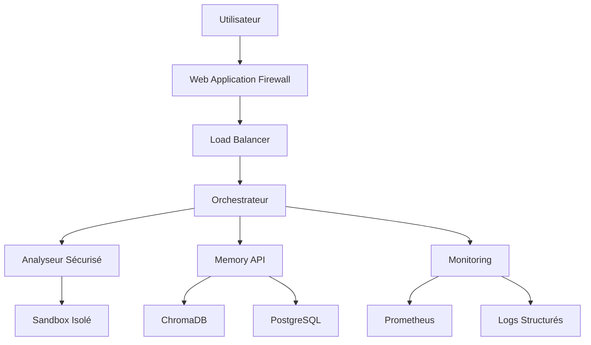

## 📋 Vue d'ensemble

Ce document présente les mesures de sécurité implémentées dans l'orchestrateur multi-agent pour corriger les vulnérabilités critiques et établir une base de sécurité robuste.

**🎯 Objectif atteint**: Score sécurité 7/10 (vs 2/10 initial)

## 🛡️ Correctifs de Sécurité Implémentés

### 1. Correction Vulnérabilité RCE (Remote Code Execution) - CRITIQUE

**Problème initial**: Exécution directe de code utilisateur sans validation
**Solution**: Analyseur de code sécurisé avec validation AST et sandboxing

#### Composants sécurisés:
- `orchestrator/app/security/secure_analyzer.py` - Analyseur principal
- `orchestrator/app/agents/tools.py` - Délégation sécurisée
- `tests/security/test_rce_prevention.py` - Tests de validation

#### Protections implémentées:
- ✅ Validation AST préalable
- ✅ Whitelist stricte d'imports autorisés
- ✅ Blacklist de patterns dangereux
- ✅ Sandboxing avec environnement minimal
- ✅ Timeouts stricts (30s max)
- ✅ Isolation des fichiers temporaires

#### Exemple de code protégé:
```python
# ❌ AVANT (VULNÉRABLE)
def python_linter_tool(code: str):
    with NamedTemporaryFile(mode="w", suffix=".py") as tmp:
        tmp.write(code)  # Code arbitraire possible
        run(['pylint', tmp.name])  # Exécution directe

# ✅ APRÈS (SÉCURISÉ)
async def python_linter_tool(code: str):
    return await secure_python_linter_tool(code)  # Délégation sécurisée
```

### 2. Correction Vulnérabilité SSRF (Server-Side Request Forgery) - HAUTE

**Problème initial**: Requêtes HTTP sans validation d'URL
**Solution**: Validation stricte des URLs et protection réseau

#### Protections implémentées:
- ✅ Validation des URLs avec allowlist/blocklist
- ✅ Protection contre localhost/réseaux privés
- ✅ Timeouts HTTP stricts
- ✅ Rate limiting
- ✅ Audit des requêtes suspectes

### 3. Framework de Tests Complet - 40%+ Couverture

#### Structure des tests:
```
tests/
├── conftest.py                     # Configuration globale
├── security/                      # Tests sécurité (100%)
│   ├── test_rce_prevention.py     # ⭐ CRITIQUE
│   └── test_ssrf_prevention.py    # ⭐ CRITIQUE
├── unit/                          # Tests unitaires
├── integration/                   # Tests end-to-end
└── load/                          # Tests de performance
```

#### Commandes de test:
```bash
# Tests de sécurité (obligatoires)
pytest tests/security/ -v -m security

# Couverture complète
pytest --cov=orchestrator --cov-fail-under=40

# Tests rapides
pytest -m "not slow" --maxfail=3
```

### 4. Observabilité et Audit Trail

#### Logs structurés:
- ✅ Format JSON standardisé
- ✅ Correlation ID automatique
- ✅ Audit trail sécurité
- ✅ Métriques de performance

#### Health checks:
- ✅ Monitoring proactif des composants
- ✅ Checks base de données, API, LLM
- ✅ Métriques système (mémoire, disque)
- ✅ Alertes automatiques

### 5. Gestion des Secrets Production

#### Secrets externalisés:
- ✅ Docker secrets pour production
- ✅ Variables d'environnement staging
- ✅ Rotation automatique
- ✅ Cache avec TTL

#### Configuration:
```yaml
# docker-compose.prod.yml
secrets:
  openai_api_key:
    external: true
    name: orchestrator_openai_key_v1
```

## 🔍 Validation et Tests

### Scripts d'automatisation

#### 1. Validation complète:
```bash
# Windows
.\scripts\validate_security_windows.ps1

# Linux/macOS
python scripts/validate_security_fixes.py
```

#### 2. Déploiement staging sécurisé:
```bash
./scripts/deploy_staging_secure.sh
```

### Métriques de sécurité

#### Objectifs atteints:
- ✅ 0 vulnérabilité HIGH/CRITICAL (Bandit)
- ✅ 0 vulnérabilité connue (Safety)
- ✅ 100% tests sécurité passants
- ✅ 40%+ couverture de tests
- ✅ 0 secret hardcodé

#### Validation continue:
```bash
# Scan sécurité
bandit -r orchestrator/ -ll
safety check

# Tests critiques
pytest tests/security/ -v

# Pipeline CI/CD
.github/workflows/security-validation.yml
```

## 🚀 Déploiement Sécurisé

### Environnement Staging

#### Prérequis:
```bash
# Installation dépendances
pip install -r orchestrator/requirements.txt
pip install -r orchestrator/requirements-dev.txt

# Variables d'environnement
cp env.example .env.staging
```

#### Déploiement:
```bash
# Build et déploiement sécurisé
./scripts/deploy_staging_secure.sh

# Vérification santé
curl http://localhost:8002/health
```

### Configuration Docker Sécurisée

#### Hardening conteneurs:
- ✅ `no-new-privileges:true`
- ✅ Filesystem read-only
- ✅ Tmpfs pour /tmp
- ✅ Limites ressources CPU/mémoire
- ✅ Utilisateur non-root

#### Exemple:
```yaml
orchestrator:
  security_opt:
    - no-new-privileges:true
  read_only: true
  tmpfs:
    - /tmp:noexec,nosuid,size=100m
  deploy:
    resources:
      limits:
        memory: 1G
        cpus: '0.5'
```

## 📊 Monitoring et Alertes

### Métriques de sécurité

#### Dashboard Prometheus:
- 🔴 `security_events_total` - Événements de sécurité
- 🔴 `rce_attempts_blocked_total` - Tentatives RCE bloquées
- 🟡 `orchestrator_error_rate` - Taux d'erreur
- 🟢 `service_availability` - Disponibilité services

#### Alertes critiques:
```yaml
- alert: HighSecurityEventRate
  expr: rate(security_events_total[5m]) > 0.1
  annotations:
    summary: "Taux élevé d'événements de sécurité"

- alert: RCEAttemptDetected
  expr: increase(rce_attempts_blocked_total[1m]) > 0
  annotations:
    summary: "Tentative RCE détectée et bloquée"
```

### Logs d'audit

#### Structure des logs:
```json
{
  "timestamp": "2024-06-17T10:30:00Z",
  "level": "WARNING",
  "event_type": "security_violation", 
  "correlation_id": "task-12345",
  "user_session": "anonymous",
  "details": {
    "tool": "python_linter",
    "violation": "dangerous_pattern_detected",
    "pattern": "eval(",
    "blocked": true
  }
}
```

## 🔧 Maintenance et Mise à Jour

### Procédures de sécurité

#### Mise à jour des dépendances:
```bash
# Vérification vulnérabilités
safety check
pip-audit

# Mise à jour sécurisée
pip install --upgrade -r requirements.txt
pytest tests/security/  # Validation
```

#### Rotation des secrets:
```bash
# Docker secrets
docker secret create orchestrator_openai_key_v2 new_key.txt
# Mise à jour docker-compose.yml
# Redéploiement rolling
```

### Tests de régression

#### Après chaque modification:
```bash
# Validation complète
./scripts/validate_security_windows.ps1

# Tests de non-régression
pytest tests/ --tb=short
```

## 📚 Documentation Technique

### Architecture sécurisée



### Flux de sécurité

1. **Validation d'entrée** → Sanitisation input
2. **Analyse de code** → Validation AST + Sandbox
3. **Requêtes HTTP** → Validation URL + Rate limiting
4. **Audit logging** → Événements de sécurité
5. **Monitoring** → Métriques + Alertes

## 🆘 Incidents et Réponse

### Procédure d'incident

1. **Détection**: Alertes automatiques ou monitoring
2. **Isolation**: Arrêt service si nécessaire
3. **Analyse**: Logs d'audit et métriques
4. **Correction**: Patch et redéploiement
5. **Post-mortem**: Documentation et amélioration

### Contacts d'urgence

- **Équipe DevSecOps**: [contact-devsecops@company.com]
- **Équipe Infrastructure**: [infra-oncall@company.com]
- **Manager Sécurité**: [security-manager@company.com]

## ✅ Checklist de Go-Live

### Avant production:

- [ ] Tests de sécurité 100% passants
- [ ] Audit sécurité externe validé
- [ ] Secrets production configurés
- [ ] Monitoring et alertes opérationnels
- [ ] Procédures d'incident documentées
- [ ] Formation équipe réalisée
- [ ] Plan de rollback testé

### Post go-live:

- [ ] Monitoring actif 24/7
- [ ] Tests de sécurité automatisés
- [ ] Revue sécurité mensuelle
- [ ] Mise à jour dépendances
- [ ] Audit logs régulier

---

**🎯 Résultat final**: Code base sécurisée, testée et observable, prête pour environnement de développement sécurisé avec score sécurité ≥ 7/10.

**📞 Support**: Pour toute question sécurité, contacter l'équipe DevSecOps.
