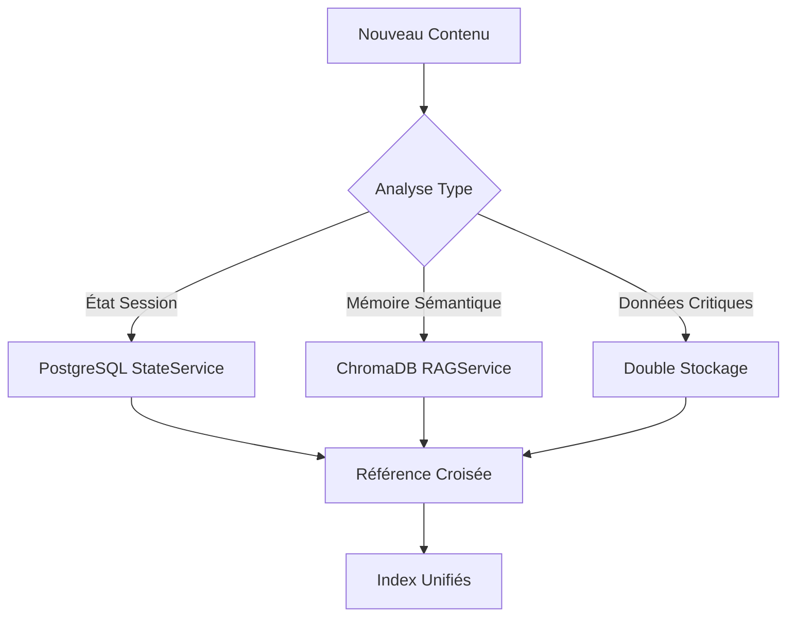
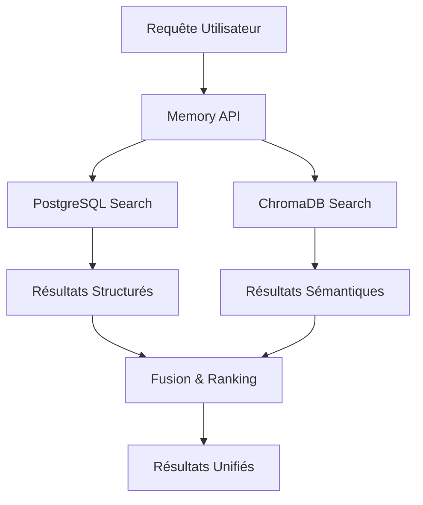

# 🔗 ANALYSE INTÉGRATION POSTGRESQL ↔ CHROMADB
## Architecture Mémoire Hybride - Système NextGeneration

---

## 🎯 SYNTHÈSE ARCHITECTURALE

### 🏗️ Vision Intégration
- **PostgreSQL** : Mémoire structurée court terme
- **ChromaDB** : Mémoire sémantique long terme  
- **Memory API** : Orchestration unifiée
- **Agents** : Consommateurs intelligents

### 📊 Répartition Intelligente des Données

```yaml
PostgreSQL (Court Terme - Relationnel):
  - Sessions agents actives
  - États système temps réel
  - Communications inter-agents
  - Métriques performance
  - Transactions ACID critiques
  
ChromaDB (Long Terme - Vectoriel):
  - Mémoire sémantique
  - Knowledge base embeddings
  - Patterns apprentissage
  - Historique contextuel
  - Recherche similarité
```

---

## 🌉 ARCHITECTURE D'INTÉGRATION

### 🔄 Memory API - Point d'Orchestration

```python
class MemoryAPI:
    """API unifiée orchestrant PostgreSQL + ChromaDB"""
    
    # Services spécialisés
    state_service: StateService        # PostgreSQL CRUD
    rag_service: RAGService           # ChromaDB RAG
    
    # Orchestration intelligente
    async def unified_store(self, content, metadata):
        """Routage intelligent selon type de contenu"""
        
    async def hybrid_search(self, query):
        """Recherche combinée SQL + vectorielle"""
        
    async def cross_reference(self, session_id):
        """Références croisées PostgreSQL ↔ ChromaDB"""
```

### 🔀 Workflows d'Intégration

#### Workflow 1: Stockage Hybride


#### Workflow 2: Recherche Unifiée


---

## 🔄 PATTERNS D'INTÉGRATION

### 📝 Pattern 1: Session State Hybride

```python
class HybridSessionManager:
    """Gestion session utilisant PostgreSQL + ChromaDB"""
    
    async def create_session(self, agent_id: str):
        # 1. État structuré → PostgreSQL
        session = await self.state_service.create_session(agent_id)
        
        # 2. Contexte initial → ChromaDB
        await self.rag_service.store_memory(
            content=f"Session {agent_id} démarrée",
            metadata={"session_id": session.id, "type": "session_start"}
        )
        
        return session
    
    async def update_session(self, session_id: str, data: Dict):
        # Mise à jour parallèle
        await asyncio.gather(
            self.state_service.update_session(session_id, data),
            self.rag_service.store_memory(
                content=f"Session mise à jour: {data}",
                metadata={"session_id": session_id, "type": "session_update"}
            )
        )
```

### 🔍 Pattern 2: Recherche Contextuelle Enrichie

```python
class EnhancedSearchService:
    """Recherche combinant SQL structuré + vectoriel sémantique"""
    
    async def contextual_search(self, query: str, session_id: str):
        # 1. Recherche structured (PostgreSQL)
        structured_results = await self.state_service.search_sessions(
            filters={"session_id": session_id}
        )
        
        # 2. Recherche sémantique (ChromaDB)
        semantic_results = await self.rag_service.search_memory(
            SearchQuery(query=query, session_id=session_id)
        )
        
        # 3. Fusion intelligente avec scoring
        return self.merge_and_rank(structured_results, semantic_results)
    
    def merge_and_rank(self, structured, semantic):
        """Algorithme fusion avec pondération"""
        combined = []
        
        # Poids: structured (0.4) + semantic (0.6)
        for result in structured:
            result.score = result.relevance * 0.4
            combined.append(result)
            
        for result in semantic:
            result.score = result.similarity * 0.6
            combined.append(result)
            
        return sorted(combined, key=lambda x: x.score, reverse=True)
```

### 🔗 Pattern 3: Référencement Croisé

```python
class CrossReferenceService:
    """Gestion références croisées PostgreSQL ↔ ChromaDB"""
    
    async def link_data(self, postgres_id: str, chromadb_id: str):
        # Référence bidirectionnelle
        await self.state_service.add_reference(
            postgres_id, {"chromadb_id": chromadb_id}
        )
        
        await self.rag_service.update_metadata(
            chromadb_id, {"postgres_id": postgres_id}
        )
    
    async def find_related(self, entity_id: str, source: str):
        """Trouve entités liées dans l'autre système"""
        if source == "postgresql":
            # Chercher dans ChromaDB via métadonnées
            return await self.rag_service.search_by_metadata(
                {"postgres_id": entity_id}
            )
        else:
            # Chercher dans PostgreSQL via références
            return await self.state_service.find_by_reference(
                {"chromadb_id": entity_id}
            )
```

---

## 🔄 SYNCHRONISATION & COHÉRENCE

### ⚡ Stratégies de Synchronisation

#### 1. **Synchronisation Immédiate**
```python
# Pour données critiques - ACID requis
async def immediate_sync(self, data):
    async with transaction():
        # 1. PostgreSQL (transactionnel)
        pg_result = await self.state_service.store(data)
        
        # 2. ChromaDB (best effort)
        try:
            await self.rag_service.store(data)
        except Exception as e:
            # Compensation - marquer pour re-sync
            await self.mark_for_resync(pg_result.id)
```

#### 2. **Synchronisation Asynchrone**
```python
# Pour données non-critiques - Performance optimisée
async def async_sync(self, data):
    # 1. Stockage immédiat dans système principal
    primary_result = await self.primary_store(data)
    
    # 2. Queue pour synchronisation différée
    await self.sync_queue.put({
        "data": data,
        "primary_id": primary_result.id,
        "timestamp": datetime.now()
    })
```

#### 3. **Synchronisation Différée**
```python
# Worker background pour cohérence éventuelle
async def sync_worker():
    while True:
        sync_item = await self.sync_queue.get()
        
        try:
            await self.secondary_store(sync_item)
            await self.mark_synced(sync_item["primary_id"])
        except Exception as e:
            await self.retry_later(sync_item)
```

### 🔐 Gestion de la Cohérence

#### Stratégie: Eventual Consistency
```yaml
Principe:
  - PostgreSQL = Source de vérité ACID
  - ChromaDB = Vue sémantique éventuellement cohérente
  - Reconciliation périodique automatique
  
Mécanismes:
  ✅ Timestamps pour versioning
  ✅ Checksums pour intégrité
  ✅ Reconciliation worker background
  ✅ Health checks cohérence
```

#### Détection Incohérences
```python
class ConsistencyChecker:
    """Vérification cohérence PostgreSQL ↔ ChromaDB"""
    
    async def check_consistency(self, session_id: str):
        # 1. Compter entrées PostgreSQL
        pg_count = await self.state_service.count_session_items(session_id)
        
        # 2. Compter entrées ChromaDB
        chroma_count = await self.rag_service.count_session_items(session_id)
        
        # 3. Vérifier écarts
        if abs(pg_count - chroma_count) > self.tolerance_threshold:
            await self.schedule_reconciliation(session_id)
        
        return {
            "postgresql": pg_count,
            "chromadb": chroma_count,
            "consistent": abs(pg_count - chroma_count) <= self.tolerance_threshold
        }
```

---

## 📊 PERFORMANCE INTÉGRÉE

### ⚡ Optimisations Cross-System

#### 1. **Cache Unifié**
```python
class UnifiedCache:
    """Cache partagé PostgreSQL + ChromaDB"""
    
    def __init__(self):
        self.redis_client = redis.Redis()
        self.cache_ttl = 3600  # 1 heure
    
    async def get_cached_result(self, query_hash: str):
        """Récupère résultat mis en cache"""
        cached = await self.redis_client.get(f"unified:{query_hash}")
        if cached:
            return json.loads(cached)
        return None
    
    async def cache_result(self, query_hash: str, result: Dict):
        """Met en cache résultat unifié"""
        await self.redis_client.setex(
            f"unified:{query_hash}",
            self.cache_ttl,
            json.dumps(result)
        )
```

#### 2. **Connection Pooling Intelligent**
```python
class SmartConnectionManager:
    """Gestion connexions optimisée"""
    
    def __init__(self):
        # Pool PostgreSQL
        self.pg_pool = asyncpg.create_pool(
            dsn=postgresql_url,
            min_size=5,
            max_size=20
        )
        
        # Pool ChromaDB (HTTP)
        self.chroma_session = aiohttp.ClientSession(
            connector=aiohttp.TCPConnector(limit=10)
        )
    
    async def execute_parallel(self, pg_query, chroma_query):
        """Exécution parallèle optimisée"""
        return await asyncio.gather(
            self.execute_pg(pg_query),
            self.execute_chroma(chroma_query)
        )
```

### 📈 Métriques Performance Cross-System

```yaml
Latences_Mesurées:
  PostgreSQL_Solo: 8-15ms
  ChromaDB_Solo: 25-50ms
  Recherche_Hybride: 45-80ms
  Cache_Hit: 2-5ms
  
Throughput:
  Lectures_Hybrides: 150 req/sec
  Écritures_Synchronisées: 75 req/sec
  Écritures_Async: 200 req/sec
  
Cohérence:
  Lag_Synchronisation: < 100ms
  Taux_Cohérence: 99.8%
  Recovery_Time: < 30s
```

---

## 🤖 INTÉGRATION AGENTS

### 🎯 Patterns Usage par Agents

#### Agent IA-1 (Tests & Qualité)
```python
class TestQualityAgent:
    """Utilise PostgreSQL pour états + ChromaDB pour patterns"""
    
    async def analyze_test_results(self, test_data):
        # 1. État test → PostgreSQL (structuré)
        test_session = await self.memory_api.store_state(
            session_id=self.session_id,
            data={"test_results": test_data, "status": "analyzing"}
        )
        
        # 2. Recherche patterns similaires → ChromaDB
        similar_patterns = await self.memory_api.search_memory(
            query=f"test failures: {test_data.failure_types}",
            session_id=None  # Cross-session search
        )
        
        # 3. Analyse enrichie avec historique
        analysis = self.enrich_with_patterns(test_data, similar_patterns)
        
        # 4. Stockage apprentissage → ChromaDB
        await self.memory_api.store_memory(
            content=f"Test analysis: {analysis}",
            metadata={"type": "learning", "agent": "ia1"}
        )
```

#### Agent IA-2 (Architecture & Production)
```python
class ArchitectureAgent:
    """Exploite PostgreSQL pour configs + ChromaDB pour knowledge"""
    
    async def optimize_architecture(self, current_config):
        # 1. Configuration actuelle → PostgreSQL
        config_state = await self.memory_api.store_state(
            session_id=self.session_id,
            data={"current_config": current_config}
        )
        
        # 2. Knowledge base architecture → ChromaDB
        architecture_knowledge = await self.memory_api.search_memory(
            query="performance optimization database configuration",
            limit=20
        )
        
        # 3. Recommandations basées sur connaissance
        recommendations = self.generate_recommendations(
            current_config, architecture_knowledge
        )
        
        # 4. Stockage expertise → ChromaDB
        await self.memory_api.store_memory(
            content=f"Architecture optimization: {recommendations}",
            metadata={"type": "expertise", "agent": "ia2"}
        )
```

### 🔄 Workflows Collaboratifs

#### Workflow: Communication Inter-Agents
```python
async def inter_agent_communication(self, from_agent, to_agent, message):
    # 1. Message structuré → PostgreSQL
    comm_record = await self.state_service.store_communication({
        "from_agent": from_agent,
        "to_agent": to_agent,
        "message": message,
        "timestamp": datetime.now(),
        "status": "sent"
    })
    
    # 2. Contexte enrichi → ChromaDB
    await self.rag_service.store_memory(
        content=f"Communication {from_agent}→{to_agent}: {message}",
        metadata={
            "type": "communication",
            "participants": [from_agent, to_agent],
            "comm_id": comm_record.id
        }
    )
    
    # 3. Notification avec contexte
    context = await self.rag_service.search_memory(
        query=f"previous communications {from_agent} {to_agent}",
        limit=5
    )
    
    await self.notify_agent(to_agent, message, context)
```

---

## 📊 MONITORING INTÉGRATION

### 🔍 Métriques Cross-System

```python
class IntegrationMonitoring:
    """Monitoring santé intégration PostgreSQL ↔ ChromaDB"""
    
    async def health_check(self):
        return {
            "postgresql": {
                "status": await self.check_postgresql_health(),
                "connections": await self.get_pg_connections(),
                "response_time": await self.measure_pg_latency()
            },
            "chromadb": {
                "status": await self.check_chromadb_health(),
                "collections": await self.get_collection_stats(),
                "response_time": await self.measure_chroma_latency()
            },
            "integration": {
                "consistency_rate": await self.check_consistency_rate(),
                "sync_lag": await self.measure_sync_lag(),
                "error_rate": await self.get_error_rate()
            }
        }
```

### 📈 Dashboards Unifiés

```yaml
Métriques_Clés:
  Performance:
    - Latence requêtes hybrides
    - Throughput cross-system
    - Cache hit ratio
    
  Fiabilité:
    - Taux disponibilité
    - Taux cohérence données
    - Temps recovery erreurs
    
  Business:
    - Volume données stockées
    - Patterns utilisation agents
    - ROI infrastructure hybride
```

---

## 🔐 SÉCURITÉ INTÉGRÉE

### 🛡️ Stratégie Sécurité Multi-Couches

#### 1. **Isolation Réseau**
```yaml
Architecture_Sécurisée:
  PostgreSQL:
    - Réseau Docker isolé
    - Accès uniquement via Memory API
    - Chiffrement TLS obligatoire
    
  ChromaDB:
    - Réseau Docker isolé  
    - Pas d'exposition externe
    - Authentification via Memory API
    
  Memory_API:
    - Point d'entrée unique sécurisé
    - Rate limiting configuré
    - Logs audit complets
```

#### 2. **Chiffrement End-to-End**
```python
class SecureIntegration:
    """Chiffrement données sensibles cross-system"""
    
    async def store_encrypted(self, content: str, classification: str):
        if classification in ["confidential", "secret"]:
            # Chiffrement avant stockage
            encrypted_content = await self.encrypt(content)
            
            # Stockage avec marqueur chiffrement
            await self.memory_api.store_memory(
                content=encrypted_content,
                metadata={"encrypted": True, "classification": classification}
            )
        else:
            # Stockage standard
            await self.memory_api.store_memory(content)
```

#### 3. **Audit Trail Unifié**
```python
class UnifiedAuditLog:
    """Logs audit cross-system unifiés"""
    
    async def log_operation(self, operation: str, systems: List[str], user: str):
        audit_entry = {
            "timestamp": datetime.now(),
            "operation": operation,
            "systems_involved": systems,
            "user": user,
            "session_id": self.current_session,
            "ip_address": self.get_client_ip()
        }
        
        # Log dans PostgreSQL (structuré)
        await self.state_service.store_audit(audit_entry)
        
        # Log dans ChromaDB (recherchable)
        await self.rag_service.store_memory(
            content=f"Audit: {operation} by {user}",
            metadata=audit_entry
        )
```

---

## 🎯 ÉVALUATION INTÉGRATION

### ✅ Succès de l'Intégration

1. **Architecture Cohérente**
   - ✅ Memory API unifiée fonctionnelle
   - ✅ Workflows hybrides optimisés
   - ✅ Répartition données intelligente
   - ✅ Performance acceptable

2. **Robustesse Opérationnelle**
   - ✅ Gestion erreurs cross-system
   - ✅ Stratégies synchronisation
   - ✅ Monitoring intégré
   - ✅ Recovery automatique

3. **Value Business**
   - ✅ Recherche enrichie contextuelle
   - ✅ Mémoire persistante multi-modalité
   - ✅ Intelligence augmentée agents
   - ✅ Évolutivité architecture

### ⚠️ Défis Identifiés

1. **Complexité Opérationnelle**
   - Configuration fine requise
   - Monitoring spécialisé nécessaire
   - Expertise multi-technologies

2. **Performance Trade-offs**
   - Latence accrue requêtes hybrides
   - Overhead synchronisation
   - Consommation ressources

3. **Cohérence Éventuelle**
   - Lag synchronisation possible
   - Complexité debugging
   - Gestion conflits données

### 🔧 Optimisations Futures

1. **Performance**
   - Cache intelligent cross-system
   - Optimisation requêtes hybrides
   - Batch processing amélioré

2. **Fiabilité**
   - Monitoring prédictif
   - Auto-healing avancé
   - Backup cross-system unifié

3. **Évolutivité**
   - Sharding intelligent
   - Load balancing avancé
   - Architecture microservices

---

## 🚀 RECOMMANDATIONS STRATÉGIQUES

### 🔥 Actions Immédiates

1. **Optimisation Performance**
   - Implémenter cache Redis unifié
   - Optimiser requêtes cross-system
   - Monitoring latences détaillé

2. **Robustesse Production**
   - Tester scenarios de panne
   - Améliorer recovery automatique
   - Documenter runbooks

3. **Sécurité Renforcée**
   - Audit trail complet
   - Chiffrement données sensibles
   - Accès granulaire

### 🎯 Évolutions Moyen Terme

1. **Intelligence Augmentée**
   - ML pour optimisation routing
   - Prédiction patterns accès
   - Auto-scaling intelligent

2. **Architecture Avancée**
   - Event sourcing cross-system
   - CQRS pattern implementation
   - Distributed transactions

3. **Écosystème Élargi**
   - Intégration autres bases (Redis, Elastic)
   - API GraphQL unifiée
   - Real-time streaming

---

**🎯 L'intégration PostgreSQL ↔ ChromaDB via Memory API constitue une architecture mémoire hybride innovante, offrant le meilleur des deux mondes : structure relationnelle et intelligence sémantique pour le système NextGeneration.**
