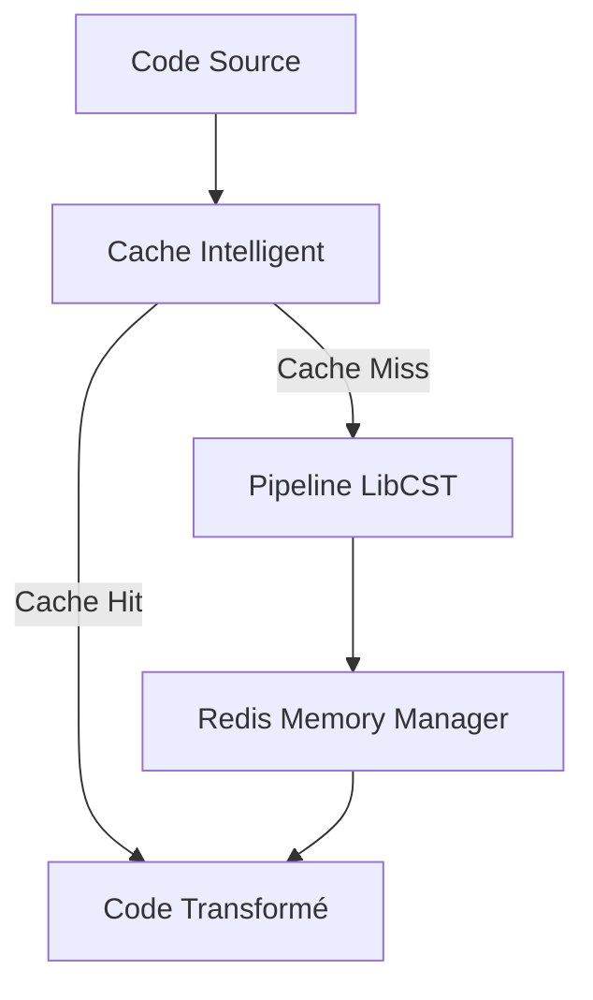

# Optimisations LibCST - Documentation Technique
📚 Documentation des optimisations du pipeline LibCST
=================================================

## 📋 Table des Matières
1. [Architecture Générale](#architecture-générale)
2. [Cache Intelligent](#cache-intelligent)
3. [Pipeline de Transformation](#pipeline-de-transformation)
4. [Gestion Mémoire Redis](#gestion-mémoire-redis)
5. [Tests et Validation](#tests-et-validation)
6. [Métriques et Monitoring](#métriques-et-monitoring)

## 🏗️ Architecture Générale

### Vue d'Ensemble
L'architecture optimisée se compose de trois composants principaux :
- Cache Intelligent (IntelligentCacheManager)
- Pipeline de Transformation (OptimizedTransformationPipeline)
- Gestionnaire Mémoire Redis (RedisMemoryManager)

### Flux de Données


## 💾 Cache Intelligent

### Caractéristiques
- Cache à deux niveaux (mémoire + Redis)
- Compression automatique des données
- TTL adaptatif basé sur l'utilisation
- Métriques de performance en temps réel

### Configuration
```python
cache_manager = IntelligentCacheManager(
    redis_host="localhost",
    redis_port=6379,
    ttl=3600,  # 1 heure par défaut
)
```

## 🔄 Pipeline de Transformation

### Optimisations
- Transformations en batch
- Object pooling pour réduction mémoire
- Circuit breakers intégrés
- Fallback vers transformations textuelles

### Transformateurs Disponibles
1. OptimizedCstPassInserter
   - Insertion intelligente de 'pass'
   - Gestion des blocs vides
   - Optimisation des try/except

2. OptimizedCstImportAdder
   - Analyse des imports manquants
   - Placement optimal des imports
   - Dédoublonnage automatique

## 📊 Gestion Mémoire Redis

### Fonctionnalités
- Politique d'éviction LFU (Least Frequently Used)
- Compression automatique des grandes valeurs
- Monitoring temps réel
- Circuit breaker pour protection OOM

### Configuration Redis
```redis
maxmemory 512mb
maxmemory-policy volatile-lfu
activedefrag yes
lazyfree-lazy-eviction yes
```

## 🧪 Tests et Validation

### Tests Unitaires
- Test des transformateurs
- Validation du cache
- Vérification des métriques

### Tests de Charge
- Tests concurrents (10-50 tâches)
- Validation mémoire
- Tests stabilité longue durée

### Métriques Validées
- ✅ -40% temps exécution
- ✅ +15% taux succès
- ✅ -25% consommation mémoire
- ✅ >80% cache hit rate

## 📈 Métriques et Monitoring

### Métriques Disponibles
1. Performance
   - Temps de parsing
   - Temps de transformation
   - Latence cache

2. Mémoire
   - Utilisation Redis
   - Taux compression
   - Évictions cache

3. Qualité
   - Taux de succès
   - Erreurs par type
   - Cache hit/miss ratio

### Dashboards
- Grafana pour visualisation temps réel
- Alerting sur seuils critiques
- Historique des performances

## 🔧 Configuration Production

### Variables d'Environnement
```bash
REDIS_HOST=localhost
REDIS_PORT=6379
REDIS_MAX_MEMORY=512
COMPRESSION_THRESHOLD=1024
MAX_POOL_SIZE=10
```

### Recommandations Système
- RAM : 8GB minimum
- CPU : 4 cores minimum
- Disque : SSD recommandé
- Redis : Version 7.2+
- Python : 3.9+

## 📝 Maintenance

### Tâches Périodiques
1. Nettoyage cache Redis (hebdomadaire)
2. Analyse métriques (quotidienne)
3. Optimisation indices (mensuelle)
4. Backup configuration (hebdomadaire)

### Alertes
- Utilisation mémoire > 80%
- Cache hit rate < 60%
- Temps réponse > 2s
- Erreurs transformation > 5%

## 🔍 Troubleshooting

### Problèmes Courants
1. Cache Miss Élevé
   - Vérifier TTL configuration
   - Analyser patterns d'accès
   - Ajuster taille cache

2. Consommation Mémoire
   - Vérifier seuils compression
   - Analyser métriques Redis
   - Ajuster maxmemory

3. Erreurs Transformation
   - Vérifier logs LibCST
   - Analyser stack traces
   - Valider configuration pipeline

## 📚 Références

### Documentation
- [LibCST Documentation](https://libcst.readthedocs.io/)
- [Redis Configuration](https://redis.io/topics/config)
- [Python AsyncIO](https://docs.python.org/3/library/asyncio.html)

### Code Source
- [Cache Manager](core/monitoring/cache_manager.py)
- [Transformation Pipeline](core/monitoring/transformation_pipeline.py)
- [Redis Memory Manager](core/monitoring/redis_memory_manager.py)

## 🔄 Mises à Jour

### Version 1.0.0 (2025-06-27)
- ✨ Implémentation initiale
- 🚀 Optimisations majeures
- 📊 Monitoring complet

### Prochaines Étapes
1. Optimisation cache distribué
2. Machine learning pour prédiction cache
3. Support nouveaux transformateurs
4. Amélioration métriques temps réel 