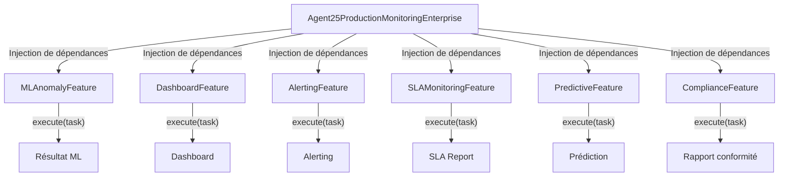

# 📊 AGENT MONITORING – PRODUCTION ENTERPRISE (Monitoring Team)

**Auteur**    : Équipe de Maintenance NextGeneration  
**Version**   : 2.0.0 – Pattern Factory Compliant Enterprise  
**Mission**   : Supervision, analyse et optimisation de la production NextGeneration, avec reporting intelligent et alerting avancé.

---

## 1. Présentation Générale

L'Agent Monitoring, **Production Enterprise**, assure la supervision avancée de la production, l'analyse des anomalies, la génération de dashboards, l'alerting intelligent et le reporting de conformité. Il s'appuie sur une architecture modulaire (Pattern Factory) et l'injection de dépendances (DI) pour garantir la robustesse, la flexibilité et la conformité aux standards du projet.

- **Supervision** : Surveillance temps réel des métriques critiques de production.
- **Analyse** : Détection d'anomalies par ML, prédiction et suivi SLA.
- **Reporting** : Génération de rapports de conformité et de performance.
- **Alerting** : Configuration d'alertes intelligentes et automatisées.

## 2. Capacités Principales

- Détection d'anomalies par ML (`ml_anomaly_setup`)
- Création de dashboards avancés (`advanced_dashboards_creation`)
- Configuration d'alerting intelligent (`intelligent_alerting_config`)
- Suivi des SLA (`sla_monitoring_setup`)
- Analytique prédictive (`predictive_analytics`)
- Reporting conformité (`compliance_reporting`)

## 3. Architecture et Concepts Clés

- **Pattern Factory** : Architecture modulaire, chaque feature est un service injectable.
- **Injection de Dépendances (DI)** : L'agent reçoit une liste de features (services) lors de l'instanciation, conformément à l'ADR-003.
- **Stubs internes** : Les features critiques sont implémentées en interne pour garantir l'autonomie de l'agent.
- **Asynchrone** : Toutes les opérations principales sont asynchrones pour la performance.
- **Conformité** : Respect des standards d'architecture et de robustesse du projet.

## 4. Guide d'Utilisation

L'agent est conçu pour être utilisé via l'injection de dépendances.

### a. Instanciation de l'Agent (Simulation de DI)
```python
from agents.agent_MONITORING_25_production_enterprise import (
    MLAnomalyFeature,
    DashboardFeature,
    AlertingFeature,
    SLAMonitoringFeature,
    PredictiveFeature,
    ComplianceFeature,
    create_agent_25_monitoring
)
features_to_inject = [
    MLAnomalyFeature(config={...}),
    DashboardFeature(config={...}),
    AlertingFeature(config={...}),
    SLAMonitoringFeature(config={...}),
    PredictiveFeature(config={...}),
    ComplianceFeature(config={...}),
]
agent = create_agent_25_monitoring(features=features_to_inject)
```

### b. Exécution d'une tâche de monitoring
```python
from core.agent_factory_architecture import Task
import asyncio

task = Task(type="ml_anomaly_setup", params={"scope": "production"})
result = asyncio.run(agent.execute_task(task))
print(result)
```

## 5. Guide d'Extension

- **Ajout de nouveaux features** : Créer une nouvelle classe de feature (ex : `PerformanceFeature`) et l'ajouter à la liste injectée.
- **Personnalisation des analyses** : Modifier ou remplacer l'implémentation d'un feature existant.
- **Intégration avec d'autres agents** : workflow collaboratif Monitoring/Production.

## 6. Journal des Améliorations

- **Version 2.0.0 (2025-06-25)** : Refactorisation complète pour la conformité Pattern Factory et DI (ADR-003). Création de stubs internes pour toutes les features critiques. Passage à l'asynchrone. Bloc de test intégré validé.
- **2025-06-25** : Mission de réparation documentée dans `MISSION_REPAIR_AGENT_MONITORING_25.md` : nettoyage, stubs, DI, validation asynchrone.

## 7. Recommandations d'Amélioration

- Ajouter des features avancées (ex : monitoring prédictif multi-cluster).
- Intégrer un dashboard de suivi temps réel.
- Automatiser la gestion des alertes critiques.

## 8. Schéma d'Architecture (Pattern Factory & DI)



## 9. Exemple de Workflow Typique

1. **Déclenchement** : Un événement de production (ex : pic de latence) déclenche une tâche de monitoring.
2. **Création de la tâche** : Un objet `Task` est instancié avec le type approprié (ex : `ml_anomaly_setup`).
3. **Exécution asynchrone** : L'agent reçoit la tâche et la transmet à la feature concernée via `await feature.execute(task)`.
4. **Traitement** : La feature effectue l'analyse (ex : détection d'anomalie) et retourne un objet `Result` enrichi de métriques.
5. **Collecte des résultats** : L'agent centralise les résultats, les logs et les métriques pour reporting ou alerting.
6. **Reporting** : Génération automatique d'un rapport ou d'une alerte selon le résultat.

## 10. Focus : Validation Asynchrone

L'agent 25 exploite l'asynchrone pour garantir la réactivité et la scalabilité, même sous forte charge.

**Avantages :**
- Exécution non bloquante des analyses et des features.
- Possibilité de paralléliser plusieurs tâches de monitoring.
- Réduction du temps de latence pour le reporting et l'alerting.

**Exemple :**
```python
import asyncio
from core.agent_factory_architecture import Task
from agents.agent_MONITORING_25_production_enterprise import (
    MLAnomalyFeature, create_agent_25_monitoring
)

features = [MLAnomalyFeature()]
agent = create_agent_25_monitoring(features=features)

task = Task(type="ml_anomaly_setup", params={"scope": "prod"})

async def main():
    result = await agent.execute_task(task)
    print(result)

asyncio.run(main())
```

**Bonnes pratiques :**
- Toujours utiliser `await` pour l'exécution des features.
- Préférer `asyncio.run()` pour les tests ou scripts de validation.
- S'assurer que chaque feature implémente bien des méthodes asynchrones (`async def`).

---

**Statut :** Production Ready – Monitoring & reporting de production actif.

---

*Document généré automatiquement par l'IA de maintenance NextGeneration.* 