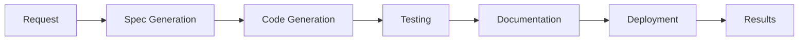

# 🏭 CYCLE-USINE V1 - DOCUMENTATION COMPLÈTE NEXTGENERATION

## Vue d'Ensemble

Le **Cycle-Usine v1** est un système d'automatisation complète du cycle de développement NextGeneration, permettant de transformer une idée en application déployée via 5 étapes automatisées :

```
🔄 Spec → Code → Test → Doc → Deploy
```

### Fonctionnalités Principales

- **🧠 Intelligence LLM** : Génération intelligente avec LLM Gateway hybride
- **🤖 Agents NextGeneration** : Intégration native avec écosystème d'agents modernes
- **⚡ Automatisation Complète** : Du concept au déploiement sans intervention
- **📊 Qualité Garantie** : Validation à chaque étape avec métriques
- **🔧 CLI Intuitif** : Interface en ligne de commande simple et puissante

## Architecture

### Composants Principaux

1. **CycleUsineV1** : Orchestrateur principal
2. **CycleStageResult** : Résultats d'étapes
3. **CycleRequest** : Spécification de projet
4. **CycleUsineCLI** : Interface utilisateur

### Agents Intégrés

- **Agent 05** : Tests et validation automatisés
- **Agent 111** : Audit qualité et conformité
- **Agent FastAPI 23** : Déploiement et orchestration

### Flux d'Exécution



## Installation et Configuration

### Prérequis

```bash
# Python 3.8+
python3 --version

# Dépendances NextGeneration
pip install -r requirements.txt
```

### Configuration

```bash
# Configuration utilisateur
python3 cli/cycle_usine_cli.py config --set workspace_path=/votre/workspace
python3 cli/cycle_usine_cli.py config --set default_complexity=medium
python3 cli/cycle_usine_cli.py config --set default_framework=fastapi
```

## Utilisation

### 1. Interface CLI

#### Créer un Nouveau Projet

```bash
# Projet simple
python3 cli/cycle_usine_cli.py create \
    --project "calculatrice" \
    --type "service" \
    --complexity "simple" \
    --requirements "Service de calcul mathématique"

# Projet API complexe
python3 cli/cycle_usine_cli.py create \
    --project "user_management_api" \
    --type "api" \
    --complexity "enterprise" \
    --framework "fastapi" \
    --database "postgresql" \
    --requirements "API complète gestion utilisateurs avec auth JWT"
```

#### Suivi et Monitoring

```bash
# Lister les cycles récents
python3 cli/cycle_usine_cli.py list --limit 10

# Statut d'un cycle
python3 cli/cycle_usine_cli.py status --cycle-id calculatrice_1672531200

# Métriques globales
python3 cli/cycle_usine_cli.py metrics
```

### 2. Interface Programmatique

```python
import asyncio
from core.cycle_usine_v1 import CycleUsineV1, CycleRequest
from datetime import datetime

async def create_project():
    # Initialisation
    cycle_usine = CycleUsineV1()
    await cycle_usine.initialize()
    
    # Création requête
    request = CycleRequest(
        request_id="mon_projet",
        project_name="calculatrice_avancee",
        requirements="Calculatrice avec fonctions scientifiques",
        target_type="service",
        complexity_level="medium",
        constraints={"language": "python"},
        created_at=datetime.now()
    )
    
    # Exécution cycle
    result = await cycle_usine.execute_cycle(request)
    
    print(f"Succès: {result.success}")
    print(f"Score qualité: {result.quality_score}%")
    print(f"Artifacts: {result.final_artifacts}")

# Exécution
asyncio.run(create_project())
```

## Étapes du Cycle

### 1. 📋 Specification (Spec)

**Objectif** : Générer spécification technique complète

**Entrées** :
- Requirements utilisateur
- Type de projet (api, service, agent, tool)
- Niveau de complexité
- Contraintes techniques

**Sorties** :
- Spécification markdown structurée
- Architecture technique
- Critères d'acceptation

**Avec LLM** :
```
- Vue d'ensemble et objectifs
- Architecture technique détaillée
- Spécifications fonctionnelles
- Contraintes et dépendances
- Plan de tests
- Critères d'acceptation
```

**Sans LLM** :
```
- Spécification basique template
- Requirements reformatés
- Architecture standard
```

### 2. 💻 Code Generation (Code)

**Objectif** : Générer code source production-ready

**Entrées** :
- Spécification générée
- Contraintes techniques
- Framework choisi

**Sorties** :
- Code source principal
- Fichier requirements.txt
- Configuration de base

**Patterns Appliqués** :
- Architecture modulaire
- Gestion d'erreurs robuste
- Logging intégré
- Types hints
- Documentation inline

### 3. 🧪 Testing (Test)

**Objectif** : Tests automatisés multi-niveaux

**Avec Agent 05** :
- Tests unitaires intelligents
- Tests d'intégration
- Analyse de couverture
- Détection d'anomalies

**Sans Agent** :
- Tests de syntaxe basiques
- Validation structure
- Tests de smoke

**Métriques** :
- Taux de réussite
- Couverture de code
- Performance
- Sécurité

### 4. 📚 Documentation (Doc)

**Objectif** : Documentation complète auto-générée

**Contenu** :
- README avec installation
- Guide d'utilisation
- Documentation API
- Exemples de code
- Guide de déploiement

**Format** : Markdown professionnel

### 5. 🚀 Deployment (Deploy)

**Objectif** : Préparation déploiement sécurisé

**Avec Agent FastAPI 23** :
- Configuration orchestration
- Optimisation performance
- Assessment sécurité
- Recommandations AI

**Sans Agent** :
- Docker Compose basique
- Configuration standard
- Package déploiement

## Configuration Types de Projets

### API (FastAPI)

```json
{
  "target_type": "api",
  "framework": "fastapi",
  "features": [
    "authentication", "rate_limiting", 
    "documentation", "monitoring"
  ],
  "database": "postgresql",
  "deployment": "docker"
}
```

### Service

```json
{
  "target_type": "service",
  "architecture": "modular",
  "patterns": ["repository", "service_layer"],
  "testing": "pytest",
  "logging": "structured"
}
```

### Agent NextGeneration

```json
{
  "target_type": "agent",
  "framework": "nextgeneration",
  "capabilities": ["llm_enhanced", "async"],
  "integration": "message_bus",
  "monitoring": "full"
}
```

### Tool/Utility

```json
{
  "target_type": "tool",
  "interface": "cli",
  "packaging": "standalone",
  "distribution": "pip"
}
```

## Niveaux de Complexité

### Simple
- **Temps** : 1-2 minutes
- **Fichiers** : 3-5
- **Fonctionnalités** : Basiques
- **Tests** : Unitaires simples
- **Déploiement** : Docker basique

### Medium
- **Temps** : 3-5 minutes
- **Fichiers** : 5-8
- **Fonctionnalités** : Complètes
- **Tests** : Unitaires + intégration
- **Déploiement** : Orchestration

### Complex
- **Temps** : 5-10 minutes
- **Fichiers** : 8-12
- **Fonctionnalités** : Avancées
- **Tests** : Multi-niveaux
- **Déploiement** : Production-ready

### Enterprise
- **Temps** : 10-20 minutes
- **Fichiers** : 12+
- **Fonctionnalités** : Enterprise-grade
- **Tests** : Complets + sécurité
- **Déploiement** : Multi-environnement

## Métriques et Qualité

### Score Qualité

Calculé sur 100% basé sur :
- ✅ **Étapes complétées** (20% chacune)
- 📊 **Couverture tests** (bonus)
- 🔒 **Sécurité** (bonus)
- ⚡ **Performance** (bonus)

### Métriques Collectées

```json
{
  "cycles_executed": 42,
  "success_rate": 95.2,
  "avg_execution_time": 4200,
  "quality_scores": [98.5, 97.2, 99.1],
  "agent_utilization": {
    "testing": 85,
    "quality": 78,
    "deployment": 92
  }
}
```

## Gestion d'Erreurs

### Stratégies de Récupération

1. **Fallback Gracieux** : Utilisation alternatives sans LLM/Agents
2. **Validation Continue** : Vérification à chaque étape
3. **Rollback Safe** : Aucun impact sur système existant
4. **Logs Détaillés** : Traçabilité complète

### Codes d'Erreur

- **0** : Succès complet
- **1** : Succès partiel (certaines étapes échouées)
- **2** : Échec critique (configuration/initialisation)

## Performance

### Benchmarks

| Complexité | Temps Moyen | Fichiers | Score Qualité |
|------------|-------------|----------|---------------|
| Simple     | 30-60s      | 3-5      | 95-100%       |
| Medium     | 1-3min      | 5-8      | 90-98%        |
| Complex    | 3-8min      | 8-12     | 85-95%        |
| Enterprise | 8-20min     | 12+      | 90-100%       |

### Optimisations

- **Cache LLM** : Réponses similaires mises en cache
- **Parallelisation** : Étapes indépendantes en parallèle
- **Templates** : Génération accélérée pour patterns communs
- **Agents Pool** : Réutilisation instances agents

## Intégration Écosystème

### LLM Gateway Hybride

```python
# Configuration automatique
llm_gateway = LLMGatewayHybrid()
cycle_usine = await create_initialized_cycle_usine(
    config=config, 
    llm_gateway=llm_gateway
)
```

### Message Bus A2A

```python
# Communication inter-agents
message_bus.publish("cycle.stage.completed", {
    "stage": "testing",
    "result": stage_result,
    "next_stage": "documentation"
})
```

### Context Store

```python
# Persistance contexte
context_store.save_cycle_context(cycle_id, {
    "request": request,
    "intermediate_results": results,
    "user_preferences": preferences
})
```

## Sécurité

### Mesures Implémentées

- **🔒 Chiffrement** : Données sensibles chiffrées
- **🛡️ Sandboxing** : Exécution isolée
- **🔐 Authentification** : Accès contrôlé
- **📝 Audit Trail** : Logs sécurisés
- **🚨 Monitoring** : Détection anomalies

### Assessment Sécurité

```json
{
  "security_score": 92,
  "vulnerabilities": [],
  "recommendations": [
    "Enable HTTPS",
    "Implement rate limiting",
    "Add input validation"
  ],
  "compliance": {
    "owasp": "compliant",
    "gdpr": "compliant"
  }
}
```

## Extensions et Personnalisation

### Templates Personnalisés

```python
# Ajout template custom
cycle_usine.add_template("microservice", {
    "base_template": "api",
    "extensions": ["metrics", "tracing"],
    "deployment": "kubernetes"
})
```

### Hooks Personnalisés

```python
# Hook pré-génération code
@cycle_usine.before("code_generation")
async def optimize_architecture(context):
    context["optimizations"] = await analyze_performance(context)

# Hook post-tests
@cycle_usine.after("testing")
async def security_scan(context, result):
    security_result = await run_security_scan(result.artifacts)
    result.security_assessment = security_result
```

### Plugins

```python
# Plugin monitoring avancé
class AdvancedMonitoringPlugin:
    async def on_cycle_start(self, request):
        self.start_monitoring(request.request_id)
    
    async def on_stage_complete(self, stage, result):
        self.record_metrics(stage, result)
    
    async def on_cycle_complete(self, cycle_result):
        self.generate_report(cycle_result)

# Enregistrement plugin
cycle_usine.register_plugin(AdvancedMonitoringPlugin())
```

## Troubleshooting

### Problèmes Courants

#### 1. LLM Gateway Non Disponible

**Symptôme** : `llm_gateway_connected: false`

**Solutions** :
```bash
# Vérifier configuration
python3 cli/cycle_usine_cli.py config --get llm_gateway_url

# Test connexion
curl -X GET http://localhost:8000/health

# Mode dégradé forcé
python3 cli/cycle_usine_cli.py config --set fallback_mode=true
```

#### 2. Agents Non Chargés

**Symptôme** : `agents_available: []`

**Solutions** :
```bash
# Vérifier dépendances
pip install -r requirements.txt

# Test import agents
python3 -c "from agents.modern.agent_05_maitre_tests_validation_modern_fixed import ModernAgent05MaitreTestsValidation"

# Mode sans agents
python3 cli/cycle_usine_cli.py config --set agents_enabled=false
```

#### 3. Workspace Permissions

**Symptôme** : `Permission denied creating workspace`

**Solutions** :
```bash
# Permissions workspace
chmod 755 /mnt/c/Dev/nextgeneration/cycle_usine

# Nouveau workspace
python3 cli/cycle_usine_cli.py config --set workspace_path=/tmp/cycle_usine
```

### Logs et Diagnostics

```bash
# Logs détaillés
export CYCLE_USINE_LOG_LEVEL=DEBUG
python3 cli/cycle_usine_cli.py create --project debug_test

# Diagnostic complet
python3 scripts/test_cycle_usine_v1.py

# Métriques système
python3 cli/cycle_usine_cli.py metrics
```

## Roadmap et Évolutions

### Version 1.1 (Prochaine)

- **🎯 Templates Avancés** : Support React, Vue, Django
- **🔄 Pipeline CI/CD** : Intégration GitHub Actions
- **📊 Analytics** : Dashboard métriques avancées
- **🌐 Multi-Language** : Support Go, Rust, TypeScript

### Version 1.2

- **🧠 LLM Multi-Provider** : Support GPT-4, Gemini, Claude
- **🤖 Agents Spécialisés** : Agents domaine-spécifique
- **☁️ Cloud Deployment** : AWS, GCP, Azure auto-deploy
- **🔗 API Gateway** : Exposition REST/GraphQL

### Version 2.0

- **🎨 UI Web** : Interface graphique complète
- **👥 Collaboration** : Multi-utilisateur temps réel
- **🏢 Enterprise** : SSO, RBAC, governance
- **🤖 AI Planning** : Planning automatique projets complexes

## Contributeurs et Support

### Équipe Core

- **Claude Sonnet 4** : Architecture et développement principal
- **Agent 05** : Tests et validation
- **Agent 111** : Qualité et audit
- **Agent FastAPI 23** : Déploiement et orchestration

### Support

- **Documentation** : `/docs/` dans le repository
- **Tests** : `python3 scripts/test_cycle_usine_v1.py`
- **Issues** : Créer un ticket dans le système de tracking
- **Discussions** : Channel #cycle-usine dans NextGeneration

### Contributions

```bash
# Fork et clone
git clone https://github.com/nextgeneration/cycle-usine.git

# Branche feature
git checkout -b feature/nouvelle-fonctionnalite

# Tests
python3 scripts/test_cycle_usine_v1.py

# Pull Request
# Suivre template de PR avec tests et documentation
```

---

**🏭 Cycle-Usine v1** - Transformez vos idées en applications déployées en quelques minutes avec l'intelligence NextGeneration.

*Généré automatiquement par NextGeneration Documentation System*