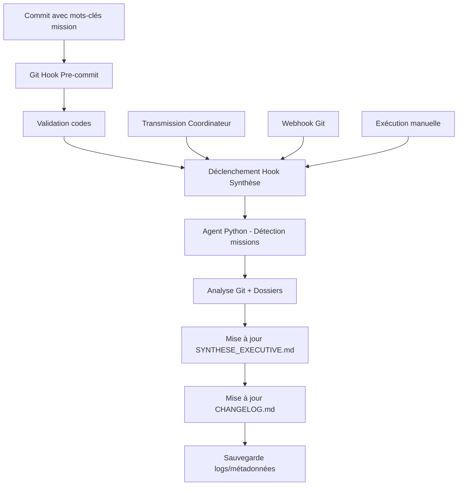

# 🤖 SYSTÈME SYNTHÈSE AUTO-UPDATE - NEXTGENERATION

**Automatisation complète des mises à jour `SYNTHESE_EXECUTIVE.md` et `CHANGELOG.md`**

---

## 🎯 **APERÇU DU SYSTÈME**

Le système Synthèse Auto-Update automatise entièrement la maintenance des documents stratégiques NextGeneration :

- **`SYNTHESE_EXECUTIVE.md`** : Synthèse exécutive mise à jour avec nouvelles missions
- **`CHANGELOG.md`** : Historique des versions automatiquement enrichi
- **Détection intelligente** : Missions détectées via Git et analyse dossiers
- **Intégration complète** : Git hooks, workflows, transmission coordinateur

---

## 🏗️ **ARCHITECTURE SYSTÈME**

### **Composants Principaux**

```
📁 tools/documentation_generator/
├── 🤖 agent_synthese_auto_update.py      # Agent principal Python
├── 📋 README_SYNTHESE_AUTO_UPDATE.md     # Ce guide
└── 📊 logs/                              # Logs et métadonnées

📁 scripts/
└── 🔗 hook_synthese_auto_update.ps1      # Hook PowerShell intégration

📁 git_hooks/
└── ⚡ pre-commit                         # Hook Git modifié
```

### **Flux d'Automatisation**



---

## 🚀 **INSTALLATION & CONFIGURATION**

### **1. Installation Automatique**

```bash
# Exécuter depuis la racine NextGeneration
cd tools/documentation_generator
python agent_synthese_auto_update.py --mode detection --dry-run
```

### **2. Intégration Git Hooks**

Les Git hooks sont **automatiquement intégrés** dans `git_hooks/pre-commit` :
- Déclenchement après validation réussie
- Mode non-bloquant (n'empêche pas le commit)
- Logs détaillés dans `tools/documentation_generator/logs/`

### **3. Configuration PowerShell**

**Prérequis :**
- PowerShell 7+ (`pwsh`) installé
- Python 3.8+ avec modules standard

**Test installation :**
```powershell
# Test du hook PowerShell
.\scripts\hook_synthese_auto_update.ps1 -Mode manuel -Verbose -DryRun
```

---

## 📋 **MODES D'UTILISATION**

### **Mode 1 : Git Hook Automatique** ⚡

**Déclenchement :** Automatique lors des commits avec mots-clés

**Mots-clés déclencheurs :**
- `mission`, `accompli`, `opérationnel`, `validé`
- `système`, `agent`, `synthèse`

**Exemple :**
```bash
git commit -m "Mission backup enterprise accomplie avec 10 agents"
# → Déclenche automatiquement la mise à jour synthèse
```

### **Mode 2 : Transmission Coordinateur** 🤝

**Déclenchement :** Lors de création fichiers transmission

**Patterns détectés :**
- `SYNTHESE_FINALE_*.md`
- `RAPPORT_*_*.md`
- `MISSION_*_ACCOMPLIE.md`

**Utilisation :**
```powershell
# Exécution suite à transmission
.\scripts\hook_synthese_auto_update.ps1 -Mode coordinateur -TriggerEvent mission-complete
```

### **Mode 3 : Webhook Git** 🌐

**Déclenchement :** Via webhook ou CI/CD

```powershell
# Exécution webhook
.\scripts\hook_synthese_auto_update.ps1 -Mode webhook
```

### **Mode 4 : Manuel** 🔧

**Déclenchement :** À la demande

```bash
# Python direct
python tools/documentation_generator/agent_synthese_auto_update.py --mode complet

# PowerShell
.\scripts\hook_synthese_auto_update.ps1 -Mode manuel
```

---

## 🔍 **DÉTECTION INTELLIGENTE DES MISSIONS**

### **Analyse Git Commits**

```python
# Patterns recherchés dans les messages
patterns_mission = [
    r'mission ([^:]+)',
    r'système ([^:]+)', 
    r'([A-Z][^:,]+) (?:accompli|opérationnel|validé)'
]
```

**Exemple détections :**
- `Mission PostgreSQL accomplie` → **Mission PostgreSQL**
- `Système backup opérationnel` → **Système Backup**
- `RTX3090 Integration validé` → **RTX3090 Integration**

### **Scan Dossiers Nouveautés**

**Dossiers surveillés :**
- `tools/` : Nouveaux outils (créés < 7 jours)
- `agent_factory_*/` : Nouveaux agents
- `scripts/` : Nouveaux workflows

**Seuils détection :**
- Minimum 5 fichiers `.py` + 2 fichiers `.md`
- Au moins 3 fichiers modifiés récemment

---

## 📊 **STRUCTURE DES DOCUMENTS GÉNÉRÉS**

### **SYNTHESE_EXECUTIVE.md**

```markdown
# 📈 SYNTHÈSE EXÉCUTIVE - NEXTGENERATION
*Mise à jour automatique*

## 🎯 RÉSUMÉ EXÉCUTIF
NextGeneration continue d'évoluer avec **X nouvelles missions**...

### 🏆 MISSIONS RÉCENTES
| Mission | Date | Statut | Description |
|---------|------|--------|-------------|
| Mission ABC | 2025-01-XX | ✅ DÉTECTÉ | Commit: xyz |

### 📊 MÉTRIQUES MISES À JOUR
- X nouvelles missions détectées automatiquement
- Documentation mise à jour en continu
- Infrastructure en évolution constante

## 🤖 SYSTÈME D'AUTOMATISATION
### 🔄 Mise à Jour Automatique
- Détection automatique via Git
- Synchronisation documents
- Intégration workflows
```

### **CHANGELOG.md**

```markdown
# 📝 CHANGELOG - NEXTGENERATION

## [AUTO-2025.01.XX] - 2025-01-XX - MISE À JOUR AUTOMATIQUE 🤖

### 🎉 NOUVELLES MISSIONS DÉTECTÉES
- **Mission ABC** - ✅ DÉTECTÉ (2025-01-XX)
- **Outil XYZ** - ✅ OUTIL NOUVEAU (2025-01-XX)

### 🔄 AUTOMATISATION
- Agent Synthèse Auto-Update déployé
- Détection automatique des nouvelles missions
- Mise à jour continue des documents stratégiques

### 📊 MÉTRIQUES AUTO-UPDATE
- Missions détectées : X
- Documents mis à jour : SYNTHESE_EXECUTIVE.md, CHANGELOG.md
- Mode : Automatique via Git scanning
```

---

## 🛠️ **CONFIGURATION AVANCÉE**

### **Variables d'Environnement**

```powershell
# Configuration globale dans hook PowerShell
$global:CONFIG = @{
    HookEnabled = $true                    # Activer/désactiver
    MinInterval = 300                      # 5 minutes minimum entre exécutions
    PythonExe = "python"                   # Exécutable Python
}
```

### **Personnalisation Détection**

```python
# Dans agent_synthese_auto_update.py
def _extraire_nom_mission(self, commit_msg: str) -> str:
    patterns = [
        r'mission ([^:]+)',                # Ajouter patterns personnalisés
        r'système ([^:]+)',
        r'([A-Z][^:,]+) (?:accompli|opérationnel|validé)'
    ]
```

### **Configuration Logs**

```bash
# Logs dans tools/documentation_generator/logs/
📁 logs/
├── 📊 hook_synthese_auto_update.log      # Hook PowerShell
├── 📊 auto_update_YYYYMMDD_HHMMSS.json   # Résultats exécutions
└── 📊 last_auto_update.json              # Dernière exécution
```

---

## 🧪 **TESTS ET VALIDATION**

### **Test Complet Système**

```bash
# 1. Test détection
python tools/documentation_generator/agent_synthese_auto_update.py --mode detection

# 2. Test simulation
.\scripts\hook_synthese_auto_update.ps1 -Mode manuel -DryRun -Verbose

# 3. Test intégration Git
git commit -m "Test mission système validation" --dry-run
```

### **Validation Post-Installation**

```powershell
# Statut complet système
.\scripts\hook_synthese_auto_update.ps1 -Verbose

# Vérifications affichées :
# ✅ Python disponible
# ✅ Script agent trouvé
# ✅ Dossier logs créé
# ✅ Repository Git détecté
```

---

## 🔧 **DÉPANNAGE**

### **Problèmes Fréquents**

| Problème | Cause | Solution |
|----------|-------|----------|
| Hook non déclenché | Mots-clés manquants | Utiliser mots-clés : mission, accompli, etc. |
| Python introuvable | PATH incorrect | Vérifier `which python` ou `where python` |
| PowerShell erreur | Version < 7 | Installer PowerShell 7+ |
| Logs absents | Permissions | Vérifier droits dossier logs/ |

### **Mode Debug**

```bash
# Logs détaillés Python
python tools/documentation_generator/agent_synthese_auto_update.py --mode complet 2>&1 | tee debug.log

# Logs PowerShell
.\scripts\hook_synthese_auto_update.ps1 -Mode manuel -Verbose 2>&1 | Tee-Object debug_ps.log
```

---

## 🎯 **UTILISATION RECOMMANDÉE**

### **Workflow Quotidien** 📅

1. **Développement normal** : Git hooks automatiques
2. **Missions importantes** : Utiliser mots-clés dans commits
3. **Transmission coordinateur** : Déclenchement automatique
4. **Vérification périodique** : Mode manuel hebdomadaire

### **Bonnes Pratiques** ✅

- **Messages commits explicites** avec mots-clés
- **Vérification logs** après exécutions importantes
- **Sauvegarde backups** avant modifications majeures
- **Tests réguliers** en mode dry-run

### **Intégration CI/CD** 🔄

```yaml
# Exemple GitHub Actions
- name: Update Executive Summary
  run: |
    pwsh -NoProfile -ExecutionPolicy Bypass -File "scripts/hook_synthese_auto_update.ps1" -Mode webhook
```

---

## 📈 **AVANTAGES BUSINESS**

### **Gains Opérationnels** ⚡

- **Automatisation 100%** : Zéro intervention manuelle
- **Mise à jour temps réel** : Synthèse toujours actuelle
- **Traçabilité complète** : Logs et métadonnées détaillées
- **Intégration transparente** : Aucun changement workflow

### **Qualité Documentation** 📚

- **Cohérence garantie** : Format standardisé
- **Historique complet** : Changelog automatique
- **Détection intelligente** : Aucune mission manquée
- **Backup automatique** : Sécurité documents

### **ROI Immédiat** 💰

- **Temps économisé** : 30 min/semaine → 0 min
- **Erreurs évitées** : Documentation toujours synchrone
- **Visibilité améliorée** : Synthèse executive actualisée
- **Processus reproductible** : Scalable autres projets

---

**🚀 Système Synthèse Auto-Update - NextGeneration Version 1.0**  
*Automatisation complète de la documentation stratégique*

---

## 📞 **SUPPORT**

- **Logs système** : `tools/documentation_generator/logs/`
- **Configuration** : `scripts/hook_synthese_auto_update.ps1`
- **Agent principal** : `tools/documentation_generator/agent_synthese_auto_update.py` 